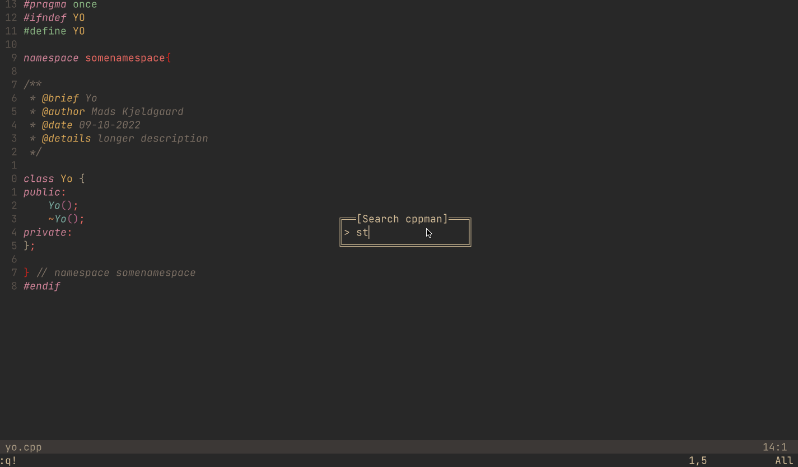

# CPPMan.nvim



A NeoVim plugin with a simple interface for the [cppman cli tool](https://github.com/aitjcize/cppman), allowing you to easily search cplusplus.com and cppreference.com without ever leaving neovim.

Plugin inspired by [vim-cppman](https://github.com/gauteh/vim-cppman)

## Installation

Install using packer. Note that [nui.nvim](https://github.com/MunifTanjim/nui.nvim) is a requirement.

```lua
-- cppman
use {
	'madskjeldgaard/cppman.nvim',
	requires = {
		{ 'MunifTanjim/nui.nvim' }
	},
	config = function()
		local cppman = require"cppman"
		cppman.setup()

		-- Make a keymap to open the word under cursor in CPPman
		vim.keymap.set("n", "<leader>cm", function()
			cppman.open_cppman_for(vim.fn.expand("<cword>"))
		end)

		-- Open search box
		vim.keymap.set("n", "<leader>cc", function()
			cppman.input()
		end)

	end
}
```

## Usage

Run `:CPPMan` without any arguments to get a search prompt or with an argument to search for a term: `:CPPMan std::array`

## Navigation
Once the manual has been open it's possible to navigate through the documentation using the same keybindings of the standalone cppman program, in normal mode:
* **K**, **<C-]>** and **<2-LeftMouse>**: allows to follow the word under cursor
* **\<C-T\>** and **\<RightMouse\>**: go back to the previous page

